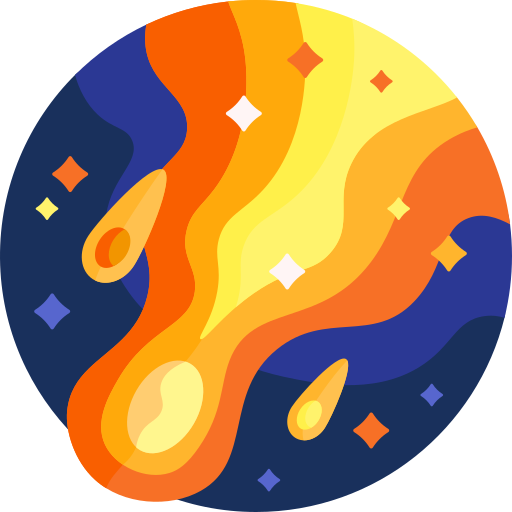
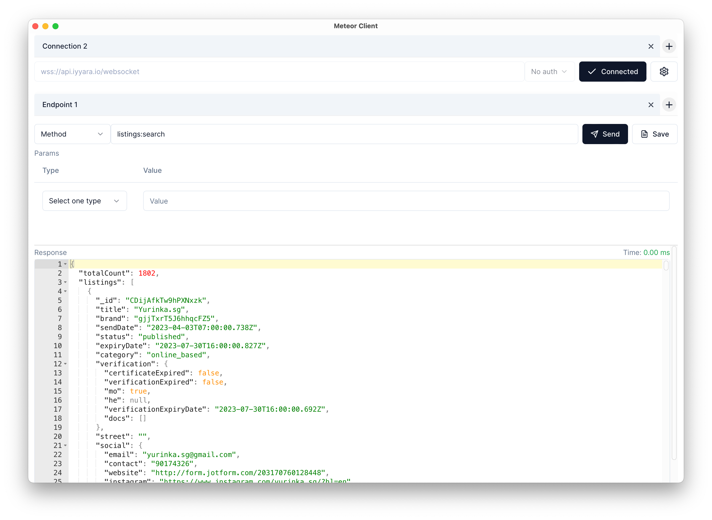

<!-- # [GitLight](https://gitlight.app) -->
Meteor Client

An DDP Client for Meteor framework

---

## About

An DDP Client for tesing Meteor framework and ~~stored into collection~~ (not yet). Available on **MacOS**, **Windows**, **Linux** and in the **browser**. Free and open-source.

> **Warning**: Meteor Client is currently in development so bugs may be present

## Features

- [x] Connect Meteor backend
- [x] Call methods
- [ ] Subscribe endpoint
- [x] Support multiple tabs without unmounting
- [ ] Add animation when switch between tabs
- [ ] Store connected connection into collections
- [ ] Import/Export collections
- [ ] Support documents for each endpoint
- [ ] Support shortcuts
- [ ] Persist state

## Contributing

[How to contribute](./CONTRIBUTING.md)

## License

[MIT](./LICENSE) © Duc Khoa